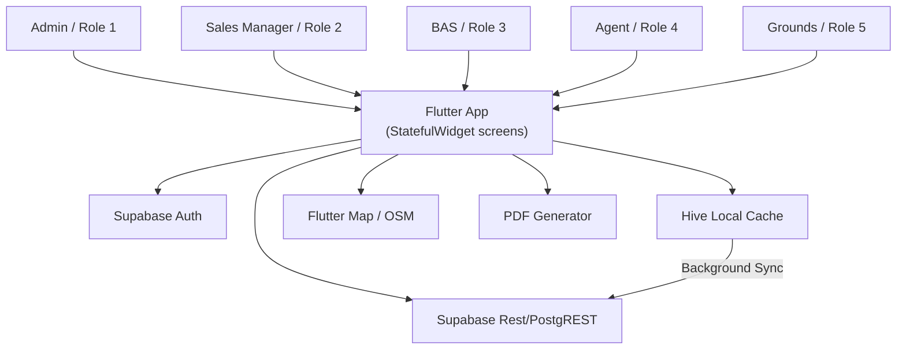
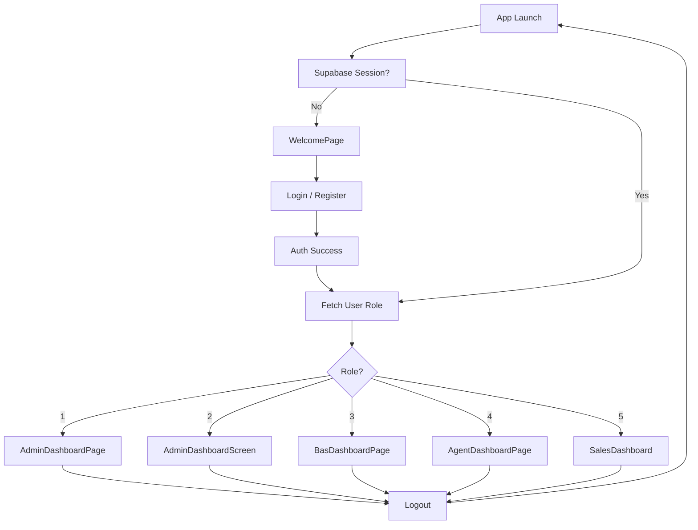
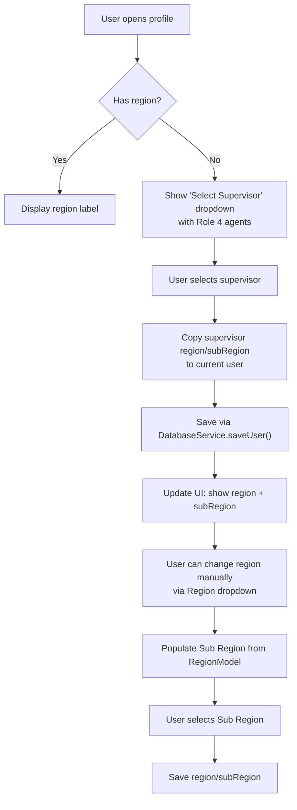
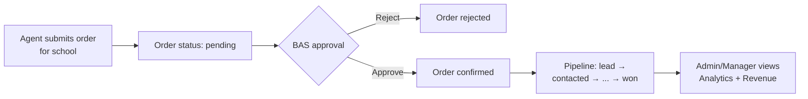
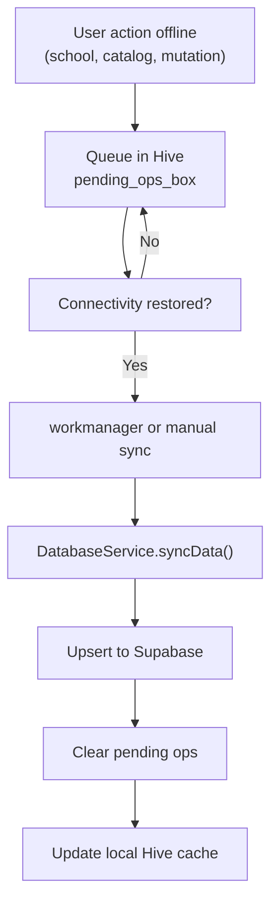
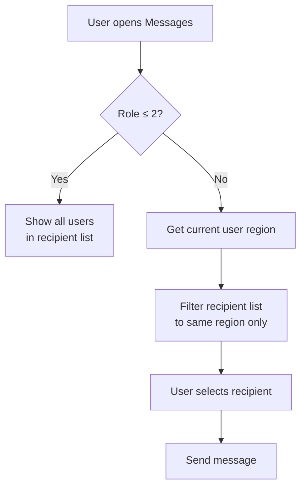

# Software Requirements Specification (SRS)
## DeHeus / Longhorn Publishers PLC — Field Sales & Distribution Mobile App

**Version:** 1.0  
**Date:** 2026-07-29  
**Status:** Draft  
**Prepared by:** Kilo  
**Reviewers:** Product / Engineering / QA

---

## Table of Contents

1. [Introduction](#1-introduction)
2. [System Overview & Architecture](#2-system-overview--architecture)
3. [User Roles & Permissions](#3-user-roles--permissions)
4. [Stakeholders & Actors](#4-stakeholders--actors)
5. [Functional Requirements by Module](#5-functional-requirements-by-module)
6. [Non-Functional Requirements](#6-non-functional-requirements)
7. [Data Model & Database Design](#7-data-model--database-design)
8. [UI / UX Requirements](#8-ui--ux-requirements)
9. [Workflow Diagrams](#9-workflow-diagrams)
10. [Service Layer & API Design](#10-service-layer--api-design)
11. [Third-Party Dependencies](#11-third-party-dependencies)
12. [Security & Compliance](#12-security--compliance)
13. [Future Enhancements](#13-future-enhancements)
14. [Appendices](#14-appendices)

---

## 1. Introduction

### 1.1 Purpose
This document specifies the functional and non-functional requirements for the DeHeus / Longhorn Publishers PLC field sales and distribution application. The application digitizes school onboarding, sample distribution, order management, debt collection, route planning, performance tracking, messaging, CRM/pipeline management, and project form workflows for a multi-role sales organization.

### 1.2 Scope
The app is a cross-platform Flutter mobile application backed by Supabase (PostgreSQL + Auth + Storage). It supports **five user roles** with role-specific dashboards and capability constraints:
- Admin (Role 1)
- Sales Manager (Role 2)
- BAS — Business Area Supervisor (Role 3)
- Agent / Supervisor (Role 4)
- Grounds Person / Sales Rep (Role 5)

### 1.3 References
- Source repository: `dehus/dehus`
- Primary backend: Supabase (`supabase_flutter`)
- Offline cache: Hive
- Maps: flutter_map + OpenStreetMap
- PDFs: `pdf` + `printing`

### 1.4 Definitions
| Term | Definition |
|------|------------|
| BAS | Business Area Supervisor |
| DeHeus | Also referred to as Longhorn Publishers PLC in this document |
| Region | Geographic sales territory managed by a BAS/Agent |
| Sub Region | Smaller subdivision within a region |
| School | Client institution (also modeled loosely as `FarmerModel` in code) |
| Pipeline | Sales pipeline stages for school deals (`PipelineStage`) |
| Hive | Local NoSQL cache used for offline-first sync |

---

## 2. System Overview & Architecture

### 2.1 Platform & Tech Stack
- **Frontend:** Flutter (Dart), Material 3
- **Backend:** Supabase (PostgreSQL, Auth, Storage, Edge Functions)
- **Offline Cache:** Hive (school box, catalog box, pending ops box)
- **Maps:** flutter_map (OpenStreetMap), latlong2
- **Location:** geolocator
- **PDFs:** pdf + printing
- **Charts:** fl_chart
- **Networking:** http, connectivity_plus
- **Background Sync:** workmanager

### 2.2 High-Level Architecture


### 2.3 Entry Points & Routing
- **App Start:** `main()` → `DeHeusApp` → `_SessionEntryPage`
- **No Session:** `WelcomePage`
- **Session Present:** Fetch role from `public.users` and route:
  - Role `1` → `/admin` → `AdminDashboardPage`
  - Role `2` → `AdminDashboardScreen`
  - Role `3` → `BasDashboardPage`
  - Role `4` → `AgentDashboardPage`
  - Role `5` → `SalesDashboard` (Grounds dashboard)
- **Logout:** `signOut()` → `/` WelcomePage

### 2.4 State Management
- No formal state framework. Uses `StatefulWidget` + direct `DatabaseService` calls + local `setState`.
- Offline-first via Hive + `DatabaseService.syncData()`.

---

## 3. User Roles & Permissions

| Role | Label | Portals / Dashboards | Permissions Summary |
|------|-------|----------------------|---------------------|
| `1` | Admin | `AdminDashboardPage`, `AdminLoginPage` | Full access: regions, targets, users, catalog, projects, analytics, geofence, route plan, social pipeline, sample receipts, orders, CRM, pipeline, messages, assignments |
| `2` | Sales Manager | `AdminDashboardScreen` | Team oversight, regions, targets, agent tracker, messages, schools, geofence, route plans, project forms, pipeline, social pipeline, samples |
| `3` | BAS | `BasDashboardPage` | Regional coverage, sales reports, approve orders, team overview, supervision dashboard, assigned tasks/geofences, performance |
| `4` | Agent / Supervisor | `AgentDashboardPage` | My schools (100km), route plan, school visits, submit order, samples, performance, messages (region-restricted), CRM (view/edit if permitted) |
| `5` | Grounds Person / Sales Rep | `SalesDashboard` | Performance carousel, quick actions (schools, profiles, samples, orders, messages, deliveries, surveys, quotations), assigned tasks, bottom-nav pipeline, messages (region-restricted) |

### 3.1 Role-Based Guards
- Admin login rejects `role != 1`.
- Admin dashboards redirect `role > 2`.
- Messages restricted to same region for non-admin/manager (`role > 2`).
- Catalog write restricted to `role <= 3`.
- Quotation creation restricted to `role == 5`.
- Sales checkout/order completion restricted by `SalesAccess` helpers.

---

## 4. Stakeholders & Actors

| Actor | Description |
|-------|-------------|
| Admin User | Top-level administrator managing users, regions, targets, catalog, and analytics |
| Sales Manager | Oversees team, defines targets, plans routes, manages social pipeline |
| BAS | Supervises regional operations, approves orders, views team performance |
| Agent / Supervisor | Field agent visiting schools, submitting orders, distributing samples |
| Grounds / Sales Rep | Ground-level sales rep handling quotations, deliveries, project forms, tasks |
| School Client | Beneficiary of sample distribution, orders, onboarding, and follow-ups |

---

## 5. Functional Requirements by Module

### 5.1 Authentication & Session
**FR-AUTH-01** — The system shall allow users to log in with email/password using Supabase Auth.  
**FR-AUTH-02** — The system shall fetch the user’s role from `public.users` after authentication.  
**FR-AUTH-03** — The system shall resolve the startup dashboard based on role.  
**FR-AUTH-04** — The system shall provide a dedicated Admin login portal with role verification (`role == 1`).  
**FR-AUTH-05** — The system shall allow logout with cleanup of navigation stack.  
**FR-AUTH-06** — The system shall check for app updates via GitHub releases on startup.

### 5.2 Profile & Personal Info
**FR-PROF-01** — The user can view and edit full name, phone, and ID number.  
**FR-PROF-02** — The user can pick and upload a profile photo to Supabase Storage (`profiles` bucket).  
**FR-PROF-03** — The system shall display a dynamic welcome header showing “Welcome Back, [fullName]”.  
**FR-PROF-04** — If the user has no region assigned, the header shall display a “Select Supervisor” dropdown listing all Role 4 agents.  
**FR-PROF-05** — Selecting a supervisor shall auto-populate the user’s `region` and `subRegion` in the `users` table.  
**FR-PROF-06** — The user can manually select a Region from the Region dropdown.  
**FR-PROF-07** — Upon region selection, the Sub Region dropdown shall be populated from `RegionModel.subRegion` values for that region, splitting comma-separated values into discrete options.  
**FR-PROF-08** — The user can select a Sub Region independently.  
**FR-PROF-09** — Region, Sub Region, and Supervisor changes shall persist immediately via `DatabaseService.saveUser()`.  
**FR-PROF-10** — The Edit Personal Info page (`UserProfilePage`) shall allow editing all profile fields and shall display supervisor, region, and subregion fields.

### 5.3 Regions Management
**FR-REG-01** — Admin shall create, edit, and delete regions.  
**FR-REG-02** — Admin shall assign/unassign agents and supervisors to regions.  
**FR-REG-03** — Admin shall add members to a region and promote them to agent role.  
**FR-REG-04** — The system shall display regions on an interactive map with markers, polylines, and polygons (`flutter_map`).  
**FR-REG-05** — The system shall support `region_assignments` joins for multi-region assignment.  
**FR-REG-06** — Admin shall search/filter regions.

### 5.4 Targets & Performance
**FR-TGT-01** — Admin and Manager shall create/edit targets by scope: Regional, Agent, BAS, Sales Rep, Individual.  
**FR-TGT-02** — Targets shall support types: Product Sales, Customer Visits, Collections, New Customers, Sample Distribution, Consignment.  
**FR-TGT-03** — Targets shall support periods: Daily, Weekly, Monthly, Yearly.  
**FR-TGT-04** — The Performance page (`TargetPerformancePage`) shall be accessible from all role dashboards (Admin, Manager, BAS, Agent, Grounds).  
**FR-TGT-05** — Non-admin users shall only see targets assigned to them or unassigned.  
**FR-TGT-06** — The page shall display tabbed metrics: Products, Visits, Collections, Customers, Samples, Consignments.  
**FR-TGT-07** — The page shall show current vs target values and percentage achievement per metric.  
**FR-TGT-08** — The Grounds dashboard progress bars shall display Sales Target, Visits, Collections, New Customers, Sample Returns, and Consignments with `LinearProgressIndicator` bars.

### 5.5 Analytics & Reporting
**FR-ANL-01** — Admin shall view analytics dashboard (`AnalyticsPage`) with fl_chart-based charts for tasks, revenue, funnel, top reps, churn, user growth, onboarders.  
**FR-ANL-02** — Admin shall export individual performance metrics to CSV.  
**FR-ANL-03** — Admin shall view regional performance charts (`RegionsPage`) with period selector.  
**FR-ANL-04** — Admin shall import catalogs via CSV.  
**FR-ANL-05** — Admin shall bulk-import schools via CSV.

### 5.6 Schools, Onboarding & Visits
**FR-SCH-01** — Agents/BAS/Grounds shall view schools within a 100km radius using `Geolocator`.  
**FR-SCH-02** — Users shall onboard new schools/agrovets with contact, location, and engagement details.  
**FR-SCH-03** — Users shall record school visits and follow-ups.  
**FR-SCH-04** — Users shall search schools by name or county.  
**FR-SCH-05** — Users shall view school profiles (`UserSchoolProfilesPage`).  
**FR-SCH-06** — Admin shall manage user schools.

### 5.7 Orders
**FR-ORD-01** — Agents/Grounds shall create orders for schools.  
**FR-ORD-02** — BAS shall approve pending orders.  
**FR-ORD-03** — Users shall view order history with status filter.  
**FR-ORD-04** — The system shall generate invoices via `InvoiceService`.  
**FR-ORD-05** — Admin/Manager shall assign books to users/regions.  
**FR-ORD-06** — SalesRep checkout and order-finalization permissions are role-controlled.

### 5.8 Samples
**FR-SMP-01** — Users shall distribute samples to schools and record returned quantities.  
**FR-SMP-02** — Users shall request samples.  
**FR-SMP-03** — Admin shall review sample receipts and requests.  
**FR-SMP-04** — Users shall calculate ROI on sample distribution.  
**FR-SMP-05** — Catalog management for sample items with stock tracking.

### 5.9 Debt Collection
**FR-DEB-01** — Users shall record debt collections against schools.  
**FR-DEB-02** — Collections shall be retrievable via `DatabaseService.getPerformanceMetrics()` and `getIndividualPerformance()`.

### 5.10 Route Plans & Geofences
**FR-RTE-01** — Admin/Manager shall assign route plans to agents/sales-reps.  
**FR-RTE-02** — Agents/sales-reps shall view their own route plans on a map.  
**FR-RTE-03** — BAS shall view assigned tasks and geofences on a map (`BasAlertsPage`).  
**FR-RTE-04** — Admin shall manage geofence boundaries.  
**FR-RTE-05** — Admin shall track assigned agents on the map (`AdminAgentTrackerScreen`).

### 5.11 Supervision (BAS)
**FR-SUP-01** — BAS shall access the Role 3 Supervision Dashboard (`Role3SupervisionDashboardPage`).  
**FR-SUP-02** — The dashboard shall load county-filtered personnel, tasks, routes, geofences, alerts, breaches, scorecards, and notes.  
**FR-SUP-03** — BAS shall approve orders and view regional sales reports.  
**FR-SUP-04** — BAS shall access team overview (`UsersListPage`).

### 5.12 CRM / Pipeline
**FR-CRM-01** — Admin and authorized users shall manage a Kanban/list-view pipeline (`AdminCrmPage`).  
**FR-CRM-02** — Pipeline stages: lead → contacted → meetingScheduled → sampleIssued → quotationSent → decisionPending → negotiation → won/lost/dormant.  
**FR-CRM-03** — Users shall change stages and update probability.  
**FR-CRM-04** — Users shall access CRM settings (`CrmSettingsPage`).  
**FR-CRM-05** — Duplicate school detection and audit logs shall be accessible.

### 5.13 Social / Communications Pipeline
**FR-SOC-01** — Admin/Manager shall view Facebook/WhatsApp pipeline (`AdminSocialPipelinePage`).  
**FR-SOC-02** — Admin/Manager shall access social inbox (`AdminSocialInboxPage`).

### 5.14 Messages
**FR-MSG-01** — Users shall send and receive messages.  
**FR-MSG-02** — Non-admin/manager users shall only message users within the same region.  
**FR-MSG-03** — Users shall mark messages as read or delete them.

### 5.15 Quotations
**FR-QTN-01** — Grounds Role 5 users shall create PDF quotations (`GroundsQuotationPage`).  
**FR-QTN-02** — Quotations shall select catalog items and schools.  
**FR-QTN-03** — Non-Role-5 access shall be rejected with a SnackBar.

### 5.16 Deliveries
**FR-DEL-01** — Grounds users shall view delivery check sheets (`GroundsDeliveriesScreen`).  
**FR-DEL-02** — Deliveries shall be modeled from `school_sample_distributions`.

### 5.17 Projects / Forms
**FR-PRJ-01** — Admin shall build dynamic project forms with 22+ question types (`ProjectFormBuilderPage`).  
**FR-PRJ-02** — Users shall view and submit assigned project forms (`Role5ProjectFormsPage`, `Role5ProjectFormSubmitPage`).  
**FR-PRJ-03** — Admin shall review form responses (`ProjectFormResponsesPage`).

### 5.18 Tasks & Alerts
**FR-TSK-01** — Admin shall create and assign tasks.  
**FR-TSK-02** — Users shall view tasks filtered by role, timeframe, status, and assignee.  
**FR-TSK-03** — Users shall mark tasks complete or delete them.  
**FR-TSK-04** — BAS shall view alerts via `BasAlertsPage` with map visualization.

### 5.19 Offline & Sync
**FR-OFF-01** — The app shall cache schools, catalog items, and pending mutations in Hive.  
**FR-OFF-02** — The app shall sync pending operations in the background via `DatabaseService.syncData()` and `workmanager`.  
**FR-OFF-03** — The user shall manually trigger sync from the SalesDashboard sync button.

---

## 6. Non-Functional Requirements

### 6.1 Performance
- **NFR-PER-01** — Dashboard screens shall render within 2 seconds on mid-range Android devices.
- **NFR-PER-02** — Map tiles and markers shall load without blocking the UI thread.
- **NFR-PER-03** — Offline sync shall process queued mutations within 30 seconds when connectivity is restored.

### 6.2 Usability
- **NFR-USB-01** — All screens shall be responsive for small phones (< 600dp), tablets (≥ 768dp), and desktop widths (≥ 1100dp).
- **NFR-USB-02** — Touch targets shall be at least 48×48dp.
- **NFR-USB-03** — Form fields shall have visible labels and validation feedback.

### 6.3 Reliability & Offline
- **NFR-REL-01** — The app shall function in read-only mode when offline; mutating operations shall queue in Hive.
- **NFR-REL-02** — Sync conflicts shall be resolved server-side using `upsert` semantics.

### 6.4 Security
- **NFR-SEC-01** — All API traffic shall occur over HTTPS (Supabase).
- **NFR-SEC-02** — Role checks shall be enforced in the UI and validated server-side by RLS.
- **NFR-SEC-03** — No API keys or secrets shall be embedded in the client beyond Supabase anon/public key.

### 6.5 Maintainability
- **NFR-MNT-01** — Screens shall use reusable widgets for cards, buttons, and form fields.
- **NFR-MNT-02** — Colors and spacing shall be centralized in `AppColors` and theme constants.

### 6.6 Compatibility
- **NFR-CMP-01** — Minimum supported Android API level: 24 (Android 7).
- **NFR-CMP-02** — Maximum supported Android API level: 34 with forward compatibility.

---

## 7. Data Model & Database Design

### 7.1 Primary Tables (Supabase / PostgreSQL)

#### users
| Column | Type | Notes |
|--------|------|-------|
| id | uuid | PK, Auth user id |
| email | text | |
| full_name | text | |
| phone | text | |
| role | integer | 1=Admin, 2=Sales Manager, 3=BAS, 4=Agent, 5=Grounds |
| region | text | Assigned territory |
| sub_region | text | Subdivision within region |
| is_synced | boolean | Local sync flag |
| created_at | timestamp | |

#### regions
| Column | Type | Notes |
|--------|------|-------|
| id | uuid | PK |
| region | text | Region name |
| sub_region | text | Comma-separated subregions |
| counties | text | Optional |
| assigned_to | uuid | FK to user |
| supervisor_id | uuid | FK to user (role 4) |
| created_at | timestamp | |

#### region_assignments
| Column | Type | Notes |
|--------|------|-------|
| id | uuid | PK |
| region_id | uuid | FK to regions |
| user_id | uuid | FK to users |
| role | integer | Expected role at assignment |
| created_at | timestamp | |

#### schools (also exposed as FarmerModel in code)
| Column | Type | Notes |
|--------|------|-------|
| id | uuid | PK |
| name | text | School name |
| phone | text | |
| county | text | |
| focus_areas | text | |
| book_category | text | |
| dealer_type | text | |
| shop_category | text | |
| latitude | numeric | |
| longitude | numeric | |
| captured_by | uuid | |
| captured_at | timestamp | |
| capture_status | text | |
| engagement_type | text | |
| is_synced | boolean | |

#### catalog_items
| Column | Type | Notes |
|--------|------|-------|
| id | uuid | PK |
| name | text | |
| category | text | |
| sku | text | |
| item_type | text | |
| unit_price | numeric | |
| stock_qty | integer | |
| is_active | boolean | |
| is_synced | boolean | |

#### school_sample_distributions
| Column | Type | Notes |
|--------|------|-------|
| id | uuid | PK |
| school_id | uuid | |
| agent_id | uuid | |
| product_name | text | |
| quantity | integer | |
| returned_qty | integer | |
| distributed_at | timestamp | |

#### sample_requests
| Column | Type | Notes |
|--------|------|-------|
| id | uuid | PK |
| user_id | uuid | |
| status | text | pending/approved/rejected |
| items | jsonb | |

#### debt_collections
| Column | Type | Notes |
|--------|------|-------|
| id | uuid | PK |
| school_id | uuid | |
| amount | numeric | |
| collected_at | timestamp | |

#### orders
| Column | Type | Notes |
|--------|------|-------|
| id | uuid | PK |
| school_id | uuid | |
| school_name | text | |
| agent_id | uuid | |
| order_number | text | |
| payment_method | text | |
| checkout_amount | numeric | |
| status | text | pending/confirmed/delivered |
| is_synced | boolean | |

#### order_items
| Column | Type | Notes |
|--------|------|-------|
| id | uuid | PK |
| order_id | uuid | |
| product_name | text | |
| category | text | |
| sku | text | |
| quantity | integer | |
| unit_price | numeric | |
| line_total | numeric | |

#### school_sales (pipeline)
| Column | Type | Notes |
|--------|------|-------|
| id | uuid | PK |
| school_id | uuid | |
| agent_id | uuid | |
| package_name | text | |
| expected_value | numeric | |
| stage | text | PipelineStage enum |
| probability | integer | 0-100 |
| is_synced | boolean | |

#### messages
| Column | Type | Notes |
|--------|------|-------|
| id | uuid | PK |
| sender_id | uuid | |
| recipient_id | uuid | |
| subject | text | |
| body | text | |
| related_school_id | uuid | |
| related_task_id | uuid | |
| is_read | boolean | |

#### tasks
| Column | Type | Notes |
|--------|------|-------|
| id | uuid | PK |
| title | text | |
| description | text | |
| target_role | integer | |
| due_at | timestamp | |
| status | text | pending/in-progress/completed |
| created_by | uuid | |
| is_synced | boolean | |

#### route_plans
| Column | Type | Notes |
|--------|------|-------|
| id | uuid | PK |
| agent_id | uuid | |
| stops | jsonb | |
| scheduled_at | timestamp | |

#### school_visits
| Column | Type | Notes |
|--------|------|-------|
| id | uuid | PK |
| agent_id | uuid | |
| school_id | uuid | |
| visited_at | timestamp | |

#### project_forms
| Column | Type | Notes |
|--------|------|-------|
| id | uuid | PK |
| title | text | |
| questions | jsonb | 22+ question types |
| assigned_to | uuid | |
| created_by | uuid | |

#### project_form_responses
| Column | Type | Notes |
|--------|------|-------|
| id | uuid | PK |
| form_id | uuid | |
| user_id | uuid | |
| answers | jsonb | |
| submitted_at | timestamp | |

#### targets
| Column | Type | Notes |
|--------|------|-------|
| id | uuid | PK |
| scope | text | regional/agent/bas/sales_rep/individual |
| region_id | uuid | |
| sub_region | text | |
| assigned_to | uuid | |
| target_type | text | product_sales, customer_visits, collections, new_customers, sample_distribution, consignment |
| target_period | text | daily/weekly/monthly/yearly |
| target_data | jsonb | |
| created_at | timestamp | |

### 7.2 Local Hive Storage
- `school_box` — cached school records
- `catalog_box` — cached catalog items
- `pending_ops_box` — queued mutations for sync

### 7.3 Auth Metadata
- `full_name`, `phone`, `id_number`, `avatar_url` — stored in Supabase Auth `user_metadata`.

---

## 8. UI / UX Requirements

### 8.1 Design System
- **Colors:** `AppColors` central palette (`primaryGreen`, `primaryDark`, `secondaryOrange`, `softGold`, `infoBlue`, `textDark`, `textMuted`, `borderGrey`, `surfaceWhite`).
- **Typography:** Consistent font sizes with responsive scaling (`isSmall` / `isCompact` checks).
- **Components:**
  - `Card` for dashboard modules
  - `InkWell` for tappable cards
  - `DropdownButtonFormField` for selectors
  - `LinearProgressIndicator` for progress bars
  - `ExpansionTile` for detail rows
  - `PageView` for carousels
  - `LayoutBuilder` for adaptive padding/column widths

### 8.2 Responsive Breakpoints
| Breakpoint | Name | Behavior |
|------------|------|----------|
| < 600dp | Small / Compact | Stacked layouts, smaller text/icons |
| 600–767dp | Tablet | Moderate spacing, wider cards |
| 800dp+ | Desktop | Sidebar nav (250px), constrained content width (900–1100px) |
| 900dp+ | Wide | Multi-column form rows |

### 8.3 Accessibility
- All icon buttons include `tooltip`.
- Form fields have labels and borders.
- Loading states use `CircularProgressIndicator`.
- Error states use red `SnackBar` messages.

---

## 9. Workflow Diagrams

### 9.1 App Navigation & Role Routing


### 9.2 Supervisor Assignment & Region Inheritance


### 9.3 Order & Pipeline Flow


### 9.4 Offline Sync Flow


### 9.5 Message Restriction Logic


---

## 10. Service Layer & API Design

### 10.1 DatabaseService (`lib/features/database/database_service.dart`)
Primary abstraction over Supabase PostgREST. Key methods grouped by concern:

| Method Group | Purpose |
|--------------|---------|
| `getUser`, `getAllUsers`, `saveUser`, `updateUserRole` | Users |
| `getRegion`, `getAllRegions`, `createRegion`, `updateRegion`, `deleteRegion` | Regions |
| `assignRegionToAgent`, `assignRegionSupervisor`, `addMemberToRegion`, `promoteRegionMemberToAgent` | Region assignments via `region_assignments` |
| `getSchool`, `getAllSchools`, `getMySchools`, `saveSchoolProfile`, `updateSchoolProfile`, `deleteSchoolProfile` | Schools |
| `syncData`, `_syncPendingOps`, `_upsertSchoolToRemote`, `_syncSchoolEngagement` | Offline sync |
| `getCatalogItems`, `upsertCatalogItems`, `decrementCatalogStock` | Catalog |
| `createTask`, `getAllTasks`, `getTasksForRole`, `deleteTask`, `updateTaskStatus` | Tasks |
| `getPerformanceMetrics`, `getIndividualPerformance` | Performance calculations |
| `getSampleDistributions`, `recordSampleDistribution`, `updateSampleReturnedQty` | Samples |
| `createSampleRequest`, `getSampleRequests`, `updateSampleRequestStatus` | Sample requests |
| `saveDebtCollection` | Collections |
| `getOrdersForCurrentUser`, `getOrderItems`, `createOrder`, `createOrderWithSchoolSale` | Orders |
| `getLatestSchoolSale`, `saveSchoolSale`, `createSchoolFollowUp` | Pipeline |
| `getMessagesForCurrentUser`, `sendMessage`, `markMessageRead`, `deleteMessage` | Messages |
| `insertWithOfflineQueue`, `upsertWithOfflineQueue`, `updateByIdWithOfflineQueue`, `deleteByIdWithOfflineQueue` | Offline-safe mutators |

### 10.2 Auth Flow
- Supabase `signInWithPassword`, `signUp`, `signOut`.
- `UserAttributes` for metadata updates.
- Session persistence via Supabase client.

### 10.3 Storage
- `profiles` bucket for profile avatars.
- PDF generation uses path provider + printing.

---

## 11. Third-Party Dependencies

| Package | Version | Purpose |
|---------|---------|---------|
| `supabase_flutter` | ^2.16.0 | Auth, database, realtime, storage |
| `hive` / `hive_flutter` | ^2.2.3 / ^1.1.0 | Local offline cache |
| `flutter_map` | ^8.3.0 | Interactive maps (OSM) |
| `latlong2` | ^0.9.1 | LatLng math for maps |
| `geolocator` | ^13.0.2 | Device GPS for 100km radius filter |
| `image_picker` | ^1.1.2 | Photo capture |
| `pdf` / `printing` | ^3.11.1 / ^5.13.4 | PDF generation |
| `fl_chart` | ^0.67.0 | Analytics charts |
| `connectivity_plus` | ^7.0.0 | Network detection |
| `workmanager` | ^0.9.0+3 | Background sync scheduling |
| `url_launcher` | 6.1.11 | Update links, phone calls |
| `http` | ^1.1.0 | Google Places / nearby search |
| `file_picker` | ^11.0.2 | File uploads (project forms) |
| `package_info_plus` | ^4.2.0 | App version info |
| `path_provider` | ^2.0.15 | File paths for PDFs/images |
| `uuid` | ^4.3.1 | ID generation |

---

## 12. Security & Compliance

- Authentication via Supabase Auth (email/password).
- Row Level Security (RLS) enforced in Supabase.
- Role checks duplicated in UI for UX guards.
- No secrets stored in client; `anonKey` / `publishableKey` only.
- HTTPS enforced for all API traffic.
- Profile photo upload restricted to authenticated user’s own storage path (`${user.id}_avatar.*`).
- Messages restricted by region for non-admin users to prevent data leakage across territories.

---

## 13. Future Enhancements

| # | Enhancement | Priority |
|---|-------------|----------|
| 1 | Real-time messaging & presence via Supabase Realtime | High |
| 2 | Push notifications for tasks and messages | High |
| 3 | Advanced analytics dashboard with drill-down filters | Medium |
| 4 | Biometric login (fingerprint/face) | Medium |
| 5 | Multi-language support (English / Swahili) | Medium |
| 6 | Barcode / QR scanning for catalog items | Low |
| 7 | Android Auto / Wear OS companion for route plans | Low |
| 8 | Web dashboard for Admin and BAS | Low |
| 9 | Batch school import validation UI | Low |
| 10 | In-app update prompt with mandatory fallback | Medium |

---

## 14. Appendices

### Appendix A — Screen Inventory

| Screen | File | Role(s) |
|--------|------|---------|
| `WelcomePage` | `lib/features/welcome/welcome_page.dart` | All |
| `DeHeusLogin` | `lib/features/welcome/auth/login_page.dart` | All |
| `AdminLoginPage` | `lib/features/welcome/auth/admin_login_page.dart` | Admin |
| `AdminDashboardPage` | `lib/features/admin/admin_dashboard_page.dart` | Admin |
| `AdminDashboardScreen` | `lib/features/admin/admin_dashboard_screen.dart` | Sales Manager |
| `BasDashboardPage` | `lib/core/constants/bas_dashboard_page.dart` | BAS |
| `AgentDashboardPage` | `lib/core/constants/agent_dashboard_page.dart` | Agent |
| `SalesDashboard` | `lib/features/profile/profile_page.dart` | Grounds / Sales Rep |
| `UserProfilePage` | `lib/features/profile/user_profile_page.dart` | All |
| `RegionsManagementPage` | `lib/features/admin/regions_management_page.dart` | Admin, Manager |
| `RegionsPage` | `lib/features/admin/regions_page.dart` | Admin, Manager |
| `TargetsPage` | `lib/features/admin/targets_page.dart` | Admin, Manager |
| `TargetPerformancePage` | `lib/features/admin/target_performance_page.dart` | All |
| `AnalyticsPage` | `lib/features/admin/analytics_page.dart` | Admin |
| `AdminIndividualPerformancePage` | `lib/features/admin/admin_individual_performance_page.dart` | Admin |
| `Role3SupervisionDashboardPage` | `lib/features/admin/role3_supervision_dashboard_page.dart` | BAS |
| `BasAlertsPage` | `lib/features/profile/bas_alerts_page.dart` | BAS |
| `MyShopsPage` | `lib/features/dashboard/my_shops_page.dart` | Agent, BAS, Grounds |
| `AgrovetOnboarding` | `lib/features/dashboard/agrovet_onboarding.dart` | All |
| `UserSchoolProfilesPage` | `lib/features/dashboard/user_school_profiles_page.dart` | All |
| `SchoolVisitPage` | `lib/features/dashboard/school_visit_page.dart` | All |
| `SchoolFollowUpPage` | `lib/features/dashboard/school_follow_up_page.dart` | All |
| `MyOrdersPage` | `lib/features/dashboard/my_orders_page.dart` | All |
| `AddOrderPage` | `lib/features/dashboard/add_order_page.dart` | All |
| `SampleDistributionPage` | `lib/features/dashboard/sample_distribution_page.dart` | All |
| `SampleReceiptsPage` | `lib/features/admin/sample_receipts_page.dart` | Admin |
| `AdminSampleRequestsPage` | `lib/features/admin/admin_sample_requests_page.dart` | Admin |
| `GroundsDeliveriesScreen` | `lib/core/constants/grounds_screens.dart` | Grounds |
| `GroundsQuotationPage` | `lib/features/dashboard/grounds_quotation_page.dart` | Grounds |
| `CollectDebtPage` | `lib/features/dashboard/collect_debt_page.dart` | All |
| `MessagesPage` | `lib/features/profile/messages_page.dart` | All |
| `AdminCrmPage` | `lib/features/admin/admin_crm_page.dart` | Admin |
| `CrmSettingsPage` | `lib/features/profile/crm_settings_page.dart` | All |
| `AdminSocialPipelinePage` | `lib/features/admin/admin_social_pipeline_page.dart` | Admin, Manager |
| `AdminSocialInboxPage` | `lib/features/admin/admin_social_inbox_page.dart` | Admin, Manager |
| `ProjectFormBuilderPage` | `lib/features/admin/project_form_builder_page.dart` | Admin |
| `ProjectFormResponsesPage` | `lib/features/admin/project_form_responses_page.dart` | Admin |
| `Role5ProjectFormsPage` | `lib/features/project/role5_project_forms_page.dart` | Grounds |
| `Role5ProjectFormSubmitPage` | `lib/features/project/role5_project_form_submit_page.dart` | Grounds |
| `AdminAssignTaskScreen` | `lib/features/admin/admin_assign_task_screen.dart` | Admin |
| `Role2RoutePlanPage` | `lib/features/admin/role2_route_plan_page.dart` | Manager |
| `AssignBooksPage` | `lib/features/admin/assign_books_page.dart` | Admin, Manager |
| `CatalogImportPage` | `lib/features/admin/catalog_import_page.dart` | Admin |
| `ImportSchoolsPage` | `lib/features/admin/import_schools_page.dart` | Admin |
| `UserSchoolOnboardingPage` | `lib/features/admin/user_school_onboarding_page.dart` | Admin |
| `CreateSchoolScreen` | `lib/features/admin/create_school_screen.dart` | Admin |
| `SchoolProfilePage` | `lib/features/admin/school_profile_page.dart` | Admin |
| `AgentRoutePlanScreen` | `lib/core/constants/agent_screens.dart` | Agent |
| `AgentSchoolVisitsScreen` | `lib/core/constants/agent_screens.dart` | Agent |
| `AgentSubmitOrderScreen` | `lib/core/constants/agent_screens.dart` | Agent |
| `AgentDistributeSamplesScreen` | `lib/core/constants/agent_screens.dart` | Agent |
| `BasRegionalCoverageScreen` | `lib/core/constants/bas_screens.dart` | BAS |
| `BasSalesReportsScreen` | `lib/core/constants/bas_screens.dart` | BAS |
| `BasApproveOrdersScreen` | `lib/core/constants/bas_screens.dart` | BAS |
| `GroundsRoutePlanScreen` | `lib/core/constants/grounds_screens.dart` | Grounds |
| `GroundsSchoolVisitsScreen` | `lib/core/constants/grounds_screens.dart` | Grounds |

### Appendix B — Model Inventory

| Model | File | Purpose |
|-------|------|---------|
| `UserModel` | `lib/models/user_model.dart` | User profile + role + region |
| `RegionModel` | `lib/models/region_model.dart` | Territory definition |
| `TargetModel` | `lib/models/target_model.dart` | Sales/target config |
| `TaskModel` | `lib/models/task_model.dart` | Assigned tasks |
| `FarmerModel / SchoolModel` | `lib/models/farmer_model.dart` | School/agrovet record |
| `OrderModel` | `lib/models/order_model.dart` | Sales order |
| `OrderItemModel` | `lib/models/order_item_model.dart` | Order line item |
| `CatalogItemModel` | `lib/models/catalog_item.dart` | Product catalog |
| `SchoolSaleModel` | `lib/models/school_sale_model.dart` | Pipeline opportunity |
| `MessageModel` | `lib/models/message_model.dart` | In-app message |
| `PipelineStage` | `lib/models/pipeline_stage.dart` | Pipeline enum |
| `StoreModel` | `lib/models/store_model.dart` | Simple store metadata |

### Appendix C — Color Palette (`AppColors`)

| Token | Value | Usage |
|-------|-------|-------|
| `primaryGreen` | `0xFF81BD42` | Primary action, app bar |
| `primaryDark` | `0xFF333333` | Headers, active icons |
| `secondaryOrange` | `0xFFF9A825` | Warnings, accents |
| `softGold` | `0xFFC5B358` | Neutral accent |
| `infoBlue` | `0xFF42A5F5` | Info states |
| `textDark` | `0xFF333333` | Body text |
| `textMuted` | `0xFF757575` | Secondary text |
| `borderGrey` | `0xFFE0E0E0` | Borders |
| `surfaceWhite` | `0xFFFFFFFF` | Surface/background |

### Appendix D — Pipeline Stages

```text
lead → contacted → meetingScheduled → sampleIssued → quotationSent → decisionPending → negotiation → won / lost / dormant
```

### Appendix E — Project Form Question Types (22)
`shortAnswer`, `paragraph`, `multipleChoice`, `checkboxes`, `dropdown`, `fileUpload`, `date`, `time`, `number`, `email`, `phone`, `url`, `rating`, `slider`, `toggle`, `linearScale`, `matrixGrid`, `sectionBreak`, `imageChoice`, `signature`, `location`, `autocomplete`, `password`, `richText`

---

*End of SRS Document*
